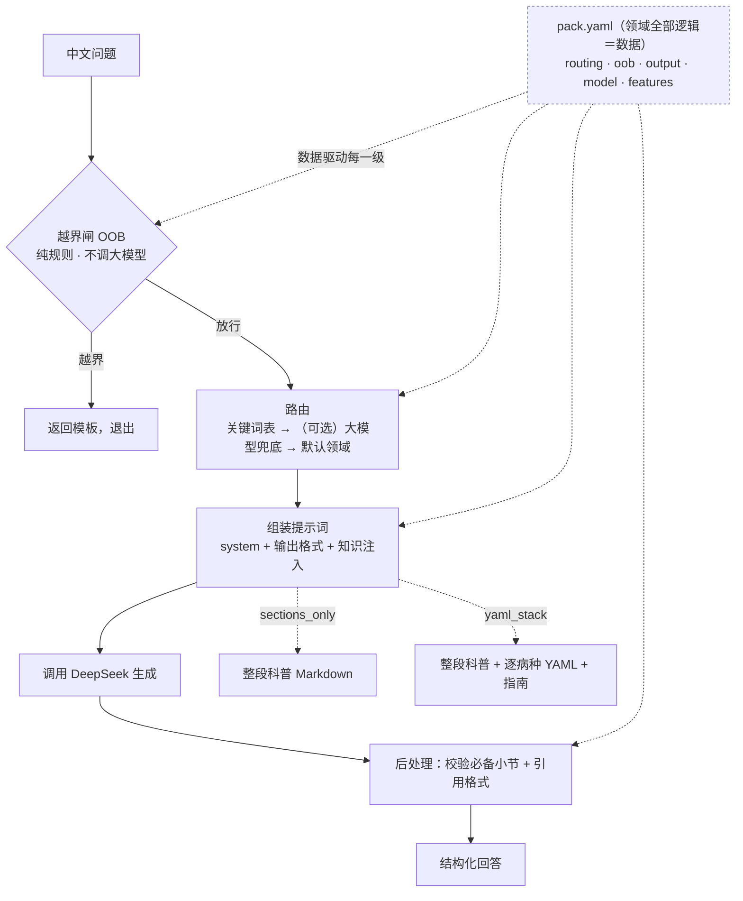

# med-agent-core · 一个内核，多个知识包

> 把六个**几乎一模一样**的中文医疗问答 fork，收敛成单一引擎 `engine/` +
> 每个领域一份自描述的「知识包」`packs/<领域>/`。
> 加一个新科室＝**写一份配置**，而不是再 fork 一份代码。

`6 个知识包` · `覆盖 内科 17 专科 + 精神 / 睡眠 / 新生儿 / 阿尔茨海默 / 症状分诊` · `迁移零回归（路由 · 越界 · 拼装 逐字一致）` · `仅依赖 PyYAML` · `Bash + Python`

---

## 一分钟看懂（无需医学或工程背景）

**遇到的问题**：我们原本有六个独立的医疗问答项目（阿尔茨海默、新生儿、睡眠、症状分诊、精神科、内科全科），
它们的**代码几乎完全相同**——同一套「判断问的是哪个病 → 把对应资料塞给大模型 → 检查答案格式」的流水线，
**只有数据不一样**（知识卡片、提示词、路由关键词、考题）。于是每修一个 bug、每加一个安全规则，都要在**六个仓库里改六遍**，
还很容易改漏、改出不一致。

**这个项目怎么做**：把那条**共享流水线**抽出来，做成唯一的 `engine/`（引擎）；把每个科室**特有的东西**
（它的知识、它的越界规则、它的输出格式）写进一份 `pack.yaml`（知识包清单）。引擎只有一份、不区分科室；
科室全是数据。换言之——

> **一句话**：不是把流水线复制六份再各自塞数据，而是**只留一条流水线，把数据做成可插拔的「知识包」**——
> 引擎读哪个包，就变成哪个科室的医生。

---

## 核心概念（先读这 5 个词）

后面会反复用到，先用大白话讲清楚（更全的解释见文末[名词速查](#附录名词速查)）：

- **引擎 / engine**：那条唯一的、与科室无关的流水线（`越界闸 → 路由 → 组装提示词 → 调大模型 → 后处理`）。
  全在 `engine/` 下，**写新科室时永远不动它**。
- **知识包 / pack**：一个科室的全部「私货」——一份 `pack.yaml` 清单，外加 `prompts/`（提示词）、
  `knowledge/`（知识）、`eval/`（考题）。引擎启动时读这份清单，就知道该怎么当这个科的医生。
- **`knowledge_injection`（关键开关）**：决定「怎么把知识喂给大模型」。`sections_only`（轻量）只注入整段科普 Markdown；
  `yaml_stack`（进阶）在此之上再叠一层逐病种的结构化 YAML 知识卡片 + 指南。**这是「一套引擎装下六个科室」的命门。**
- **越界 / OOB（out-of-bounds）**：超出「科普问答」边界的请求（要手术方案、化疗剂量、让它替你确诊）。
  由**纯规则**毫秒级拦下并返回模板，绝不硬答。
- **平价 / parity**：迁移正确性的判据——同一个问题，新引擎产出的**路由结果、越界判定、最终喂给大模型的提示词**，
  与老 fork **逐字节一致**。这是「零回归」的硬证据。

---

## 看它怎么答

这个项目的看点不是「答得多好」（那是各知识包的事），而是**同一套引擎、同一组命令，如何同时服务一个轻量包和一个进阶包**。
以下命令均为**真实输出**，且**不需要 API 密钥**（越界、路由、校验都是确定性的本地计算）。

### ① 有哪些知识包

```bash
$ ./med-agent list-packs
alzheimer
internal-med
neonatal
psy
sleep
stcc
```

### ② 同样的命令，喂不同的包

`alzheimer`（轻量包，`sections_only`）与 `internal-med`（进阶包，`yaml_stack`）跑的是**完全相同的子命令**，
引擎只在「怎么注入知识」这一步分叉：

```bash
# 路由：判断问题落到哪个领域（纯关键词匹配，毫秒级，不花钱）
$ ./med-agent route --pack alzheimer    "每周做几次有氧"
lifestyle
$ ./med-agent route --pack internal-med "高血压平时饮食要注意什么"
cardiology:hypertension

# 越界闸：放行还是拦截（返回 in_scope / out_of_scope:<类型>）
$ ./med-agent oob --pack alzheimer "推荐几个理财产品"
out_of_scope:unrelated
$ ./med-agent oob --pack alzheimer "我妈轻度阿尔茨海默，平时怎么照护"
in_scope

# 完整问答（这一步才需要 DEEPSEEK_API_KEY，或命中缓存）
$ ./med-agent ask --pack internal-med --mode doctor "高血压的血压控制目标是多少"
【定义与流行病学】……
【循证管理】……          # ← 进阶包额外叠了逐病种 YAML 知识卡片 + 证据等级
【红旗症状/转诊指征】……  （以上为示意节选）
```

> **同一引擎、两种注入**：引擎读到 `internal-med` 的 `features.knowledge_injection: yaml_stack`，
> 就在整段科普之外再叠一层结构化知识；读到 `alzheimer` 的 `sections_only`，就只注入整段科普。
> 命令、流水线、校验逻辑——其余完全一样。

### ③ 安全闸（精神科专属）

精神科是**安全关键**领域，单独配了一道**失败即拦截**的危机闸（隐性自杀信号必须 100% 拦下）：

```bash
$ ./med-agent crisis-check --pack psy
━━━ crisis gate: psy ━━━
  recall (must intercept) : 19/19
  precision (must not)    : 6/6
PASS: all crisis signals intercepted, no false negatives.
```

---

## 迁移准不准（平价验证）

「把六份代码合成一份」最大的风险是**悄悄改变了行为**。所以验收标准不是「跑得通」，而是
**新引擎在每个包上的确定性产出，与它的源 fork 逐字节一致**——全部**离线、无需密钥**即可复现。

| 源 fork | 知识包 | 注入策略 | 确定性子层平价（越界 · 路由 · 提示词拼装） |
|---|---|---|---|
| med-agent-ad | `alzheimer` | sections_only | OOB 72/72 · route 60/60 · build 5/5 |
| med-agent-inner-all | `internal-med` | yaml_stack | OOB 180/180 · route 180/180 · build 6/6（患者+医生）|
| med-agent-neo | `neonatal` | sections_only | OOB 67/67 · route 57/57 · build 8/8 |
| med-agent-sleep | `sleep` | sections_only | OOB 84/84 · route 70/70 · build 8/8 |
| med-agent-stcc | `stcc` | sections_only（markdown 摄入）| OOB 139/139 · route 124/124 · build 8/8 |
| med-agent-psy | `psy` | yaml_stack（深度核验 · 可溯源页码）| OOB 67/67 · route 55/55 · build 8/8 |

> 「build」比对的是**完整的 DeepSeek 请求负载**（system + user + 模型参数），`json.loads` 后逐字段相等。
> 既然喂给模型的提示词逐字节一致，**引擎的分数就等于 fork 的分数**——下表的带密钥评测只是把这一点量化记录下来。

带密钥跑的**评分闸**（另一个大模型当考官，满分 30，过线 25.5 / 0.85）：

| 知识包 | 评分均值 /30 | 危机召回 | 越界拦截 | 零幻觉 | 安全分级 |
|---|:---:|:---:|:---:|:---:|---|
| alzheimer | 29.32 | — | 0.875 | 1.00 | education |
| internal-med | 29.15 | — | 1.00 | 1.00 | standard-clinical |
| neonatal | 29.38 | — | 0.778 | 1.00 | standard-clinical |
| psy | 29.77 | **19/19** | 0.909 | 1.00 | **safety-critical** |
| sleep | 27.47 | — | 0.875 | 1.00 | education |
| stcc | 27.73 | — | 0.824 | 1.00 | standard-clinical |

> 六个包全部越过 0.85 评分线、零评测错误、零幻觉。**精神科不是其余几个的「同级」**——漏掉一个自杀信号，
> 比覆盖度低分严重得多，所以它独享一道确定性、失败即拦截的危机闸（`crisis-check`，与源 fork 逐字节一致）。
> 完整表格与口径说明见 [`docs/MIGRATION.md`](./docs/MIGRATION.md)。

---

## 为什么这样设计

几条与众不同、也是这个项目最花心思的地方：

- **数据即知识包，引擎一字不碰**：每个 fork 原先硬编码在代码里的逻辑（路由表、越界规则、输出格式、模型参数），
  全部变成 `pack.yaml` 里的数据。加一个科室 = 写一份清单，引擎零改动。这把「六处改六遍」压成「一处改一遍」。
- **`knowledge_injection` 双策略是命门**：原 PLAN 假设每个科室都在运行时读逐病种 YAML——但这只对进阶 fork
  （内科、精神）成立；轻量 fork（AD、新生儿、睡眠、分诊）只注入整段 Markdown，它们的 YAML 仅是构建期素材。
  强行用一套契约，会悄悄改变轻量包行为、打破平价。于是引入 `sections_only` / `yaml_stack` 两挡——
  一套引擎、两种注入、按包选择。
- **安全分级，而非一刀切**：不是每个包风险相同，就不该共用一条验收线。精神科（safety-critical）独享失败即拦截的
  危机闸；内科 / 分诊 / 新生儿是 standard-clinical；阿尔茨海默 / 睡眠是 education。
- **确定性子层可无密钥验证**：越界、路由、提示词拼装全是纯文本计算，不进大模型。所以「迁移有没有改变行为」
  可以离线、零成本、逐字节地证明——这正是平价表的底气。
- **越界请求毫秒级拦截**：手术决策、化疗剂量、要求确诊等超纲请求，由纯规则在生成前拦下并返回模板，
  根本不进入大模型环节——既省钱，又守住安全底线。

---

## 架构

> 以下进入技术细节。引擎只有一条在线流水线；每一级的「科室个性」都来自 `pack.yaml` 这份数据，
> 由 `schema/pack.schema.json` 这份契约校验。



> 不支持 mermaid 的查看器，可读作：
> `问题 → 越界闸（拦截则给模板退出）→ 路由 → 组装提示词（按 sections_only / yaml_stack 注入知识）→ DeepSeek 生成 → 后处理校验 → 回答`；
> 而 `pack.yaml` 作为数据，喂入越界、路由、组装、后处理**每一级**。

名词对照：**引擎**＝那条唯一的流水线（`engine/*.sh` + `engine/*.py`）；**知识包**＝`packs/<领域>/`；
**契约**＝`schema/pack.schema.json`（每份 `pack.yaml` 都必须通过它的校验）。

---

## 快速开始

```bash
# ① 安装依赖（极简：仅 PyYAML）
pip install pyyaml

# ② 配置唯一的外部依赖：DeepSeek API 密钥（仅 ask / eval 需要）
echo 'DEEPSEEK_API_KEY=sk-...' > .env       # core 根目录或某个 pack 目录均可

# ③ 用起来（前三条无需密钥）
./med-agent list-packs                                   # 列出全部 6 个知识包
./med-agent validate --pack alzheimer                    # 加载并校验清单（打印 JSON）
./med-agent oob      --pack alzheimer "推荐几个理财产品"    # in_scope / out_of_scope:<类型>
./med-agent route    --pack internal-med "高血压饮食注意"   # 路由到的领域
./med-agent ask      --pack internal-med --mode doctor "高血压控制目标是多少"   # 完整问答（需密钥）
./med-agent eval     --pack internal-med                 # 评分闸（需密钥）
```

> 注：**命中缓存的 payload 可零网络、无密钥**地复现问答；越界 / 路由 / 校验本就不调用大模型。

### 命令速查（`./med-agent <命令>`）

| 命令 | 作用 | 需要密钥 |
|---|---|:---:|
| `list-packs` | 列出全部知识包 id | 否 |
| `list-domains --pack P` | 列出某包可路由的领域 | 否 |
| `validate --pack P` | 加载并校验 `pack.yaml`，打印 JSON | 否 |
| `route --pack P "问题"` | 打印路由到的领域 | 否 |
| `oob --pack P [--mode M] "问题"` | 打印 `in_scope` / `out_of_scope:<类型>` | 否 |
| `ask --pack P [--mode M] [--domain D] [--debug] "问题"` | 端到端完整问答 | **是** |
| `eval --pack P [--limit N] [--id X] [--mode M]` | 对 `eval/gold.yaml` 跑评分闸 | **是** |
| `eval-oob --pack P` | 确定性越界拦截评测 | 否 |
| `crisis-check --pack P` | 失败即拦截的危机闸（安全关键包，目前仅 psy）| 否 |

`--pack` 接受**包名**（解析到 `packs/<名>`）或**目录路径**；`--mode` 为 `patient`（默认）或 `doctor`（仅双受众包支持）。

---

## 加一个新领域（写一个知识包）

核心承诺：**只写一个 pack 目录，永不碰 `engine/`**。完整步骤见 [`docs/PACK-AUTHORING.md`](./docs/PACK-AUTHORING.md)；要点：

1. 在 `packs/<你的领域>/` 下放一份 `pack.yaml`，并附 `prompts/`、`knowledge/`、`eval/`。
2. 拨好命门开关 `features.knowledge_injection`：只有整段科普 → `sections_only`；还要叠逐病种结构化知识 → `yaml_stack`。
3. `./med-agent validate --pack <你的领域>` 通过（`schema/pack.schema.json` 即契约）。

`pack.yaml` 骨架（字段含义见契约文件）：

```yaml
id: your-domain                 # 必须等于目录名
name: 某某科普顾问
source: { title: ..., kind: consensus|textbook|protocol|guideline }
audiences: [patient]            # 或 [patient, doctor]
features:
  knowledge_injection: sections_only   # 或 yaml_stack（命门）
  page_traceable: false                # 教材类设 true，开启页码溯源校验
  deep_eval: false                     # 设 true 开启逐条声明核验 + 回炉
routing: { map: knowledge/category_index.yaml, fallback: ..., llm_fallback: false }
oob:     { blocklist: [ { type: surgery, pattern: "正则", unless: "豁免正则" } ] }
output:  { patient: { required_sections: ["【这是什么】", ...], citation_pattern: "..." } }
model:   { patient: { temperature: 0.3, max_tokens: 1500 } }
```

---

## 项目结构

```text
engine/         唯一的共享引擎（与科室无关）
                ├─ router.sh · oob_check.sh · build_prompt.sh · call_llm.sh · postprocess.sh · ask.sh
                ├─ load_pack.py（清单加载/校验，契约边界）· eval.py · eval_oob.py · crisis_check.py · list_domains.py
                └─ tools/  构建期工具（migrate_forks / extract_router / build_sections / extract_yaml）
packs/<领域>/   一个科室＝一份知识包
                ├─ pack.yaml          清单（id · 来源 · 受众 · features · routing · oob · output · model · eval）
                ├─ prompts/           system_base · output_schema · oob_templates（含 _doctor 变体）· sections/*.md
                ├─ knowledge/         category_index.yaml（路由表）+（yaml_stack 包）逐专科目录，内含逐病种 *.yaml 与 guidelines/
                └─ eval/              gold.yaml · oob_gold.yaml · judge_prompt.md（psy 另有 crisis_gold.yaml）
schema/         pack.schema.json —— 每份 pack.yaml 必须通过的契约
med-agent       唯一调度入口：ask | route | oob | validate | eval | eval-oob | crisis-check | list-packs | list-domains
docs/           IMPLEMENTATION.md · MIGRATION.md · PACK-AUTHORING.md
scripts/        archive_forks.sh（fork 处置，未执行——见设计取舍）
```

六个知识包及其安全分级：
`alzheimer`（education · 患者）· `internal-med`（standard-clinical · 患者+医生 · 17 专科）·
`neonatal`（standard-clinical · 患者）· `psy`（**safety-critical** · 患者+医生）·
`sleep`（education · 患者）· `stcc`（standard-clinical · 患者）。

---

## 设计取舍

- **`sections_only` vs `yaml_stack`**：两挡注入是「一套引擎装下六个包」的代价与红利。轻量包不读运行时 YAML（更简单、更快），
  进阶包叠结构化知识（更可控、可标证据等级）。强行统一会打破平价——故保留两挡，由 `pack.yaml` 按包选择。
- **monorepo vs 拆库（PLAN §7，待定）**：当前是 monorepo（`engine/` + `packs/*`，PLAN 推荐）；
  另一选项是「引擎库 + 各包独立库」。这是尚未拍板的可逆决策。
- **fork 处置（PLAN §7，待定且不可逆）**：每个老 fork 已带 `DEPRECATED.md` 指向其包；
  `scripts/archive_forks.sh` 可执行「只读归档 / 删除」，但**尚未运行**。无论选哪种，都须**先过实时平价闸**——
  `knowledge/` 才是真正的资产（the moat）。
- **数据私有**：原书 PDF 与抽取出的 `source/` 受版权保护、不随仓库分发；复用包内已抽好的 `knowledge/` + 一个 DeepSeek 密钥即可问答。

---

## 附录：名词速查

| 名词 | 一句话解释 |
|---|---|
| **引擎 / engine** | 唯一一条、与科室无关的流水线（`越界 → 路由 → 组装 → 生成 → 后处理`），全在 `engine/`，写新科室时不动它。 |
| **知识包 / pack** | 一个科室的全部私货：`pack.yaml` 清单 + `prompts/` + `knowledge/` + `eval/`。引擎读它就变成那个科的医生。 |
| **`knowledge_injection`** | 命门开关：`sections_only`（只注入整段科普）/ `yaml_stack`（再叠逐病种结构化 YAML + 指南）。 |
| **`sections_only`（轻量）** | 只把 `prompts/sections/*.md` 整段科普喂给模型；YAML 仅是构建期素材，运行时不读。 |
| **`yaml_stack`（进阶）** | 在整段科普之外，运行时再叠一层逐病种 YAML 知识卡片 + 指南，可带证据等级与页码。 |
| **平价 / parity** | 迁移正确性判据：新引擎的路由 / 越界 / 提示词拼装与源 fork **逐字节一致**，可离线无密钥复现。 |
| **越界 / OOB** | 超出科普边界的请求（手术、化疗剂量、确诊），纯规则毫秒级拦下给模板，不进大模型。 |
| **`pack.yaml` / 契约** | 每个包的自描述清单；由 `schema/pack.schema.json` 校验。引擎只认这份数据，不认科室名。 |
| **深度核验 / `deep_eval`** | 进阶能力：把答案拆成逐条声明回去核对知识，对不上就回炉重写（降幻觉）。 |
| **危机闸 / crisis gate** | 精神科专属、失败即拦截的安全闸：隐性自杀信号必须 100% 拦截，漏一个即 exit 1。 |
| **页码溯源 / `page_traceable`** | 教材类包开启后，校验每条知识的折页码落在该疾病所属章节范围内（区别于 PDF 物理页）。 |
| **评分闸 / LLM-judge** | 用另一个大模型按细则给答案打分（满分 30，过线 0.85），实现自动化评测。 |
| **安全分级 / safety tier** | 按风险分层验收：safety-critical（psy）/ standard-clinical / education，不共用同一条线。 |
| **DeepSeek** | 本项目调用的大模型服务，是唯一外部依赖（`ask` / `eval` 需自备 API 密钥）。 |

---

> 原始设计、执行记录与各种「坑」的来龙去脉，见
> [`PLAN-medagent-consolidation.md`](./PLAN-medagent-consolidation.md) ·
> [`docs/IMPLEMENTATION.md`](./docs/IMPLEMENTATION.md) · [`docs/MIGRATION.md`](./docs/MIGRATION.md) ·
> [`docs/PACK-AUTHORING.md`](./docs/PACK-AUTHORING.md)。
